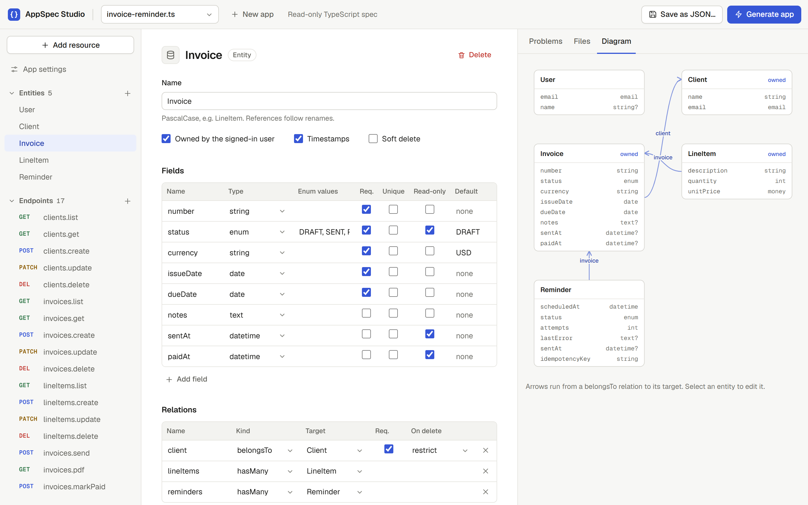
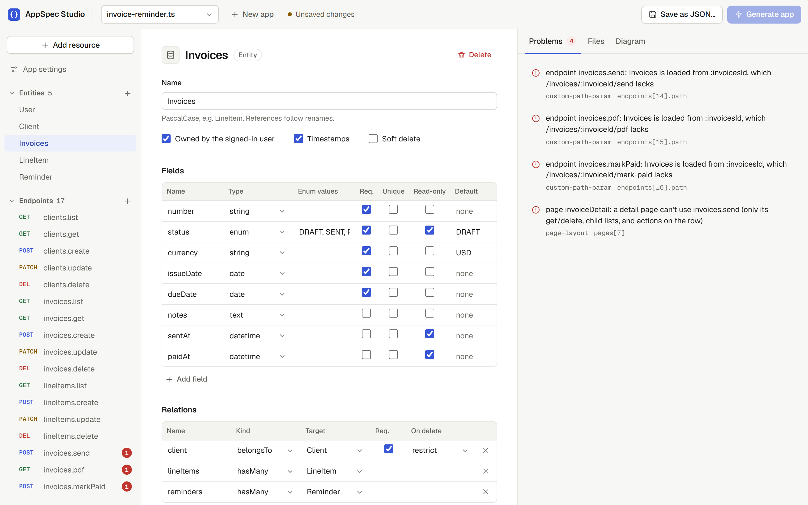
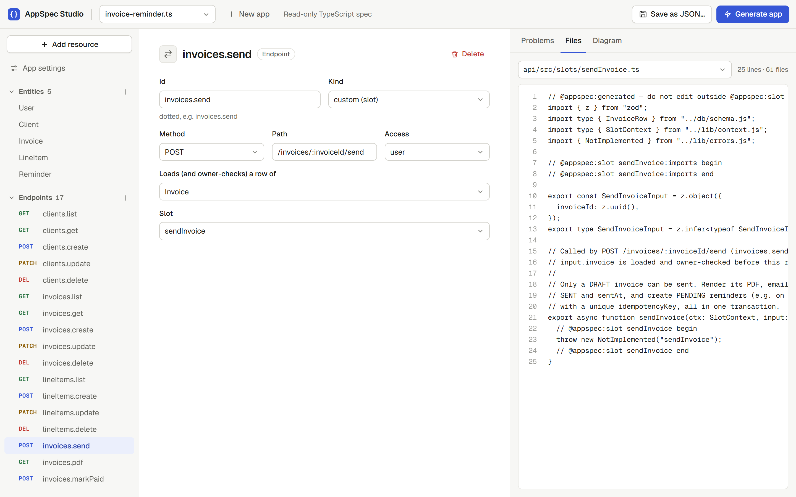

# AppSpec

**Describe an app. Get a working full-stack app.**

AppSpec is a compiler for web apps. You write a short description of an app,
listing its data, what users can do, and its screens. AppSpec turns that into a
complete, runnable project: database, backend API, login, website and Docker
setup.

It does this **without AI**. Every file is produced by plain, predictable code,
so the same description always gives exactly the same app. The only part that
needs a human (or, later, an AI agent) is logic too specific to describe as
data, like "email this invoice as a PDF". AppSpec leaves clearly labelled empty
boxes, called **slots**, for exactly those parts.

<picture>
  <source media="(prefers-color-scheme: dark)" srcset="docs/screenshots/studio-editor-dark.png">
  
</picture>

*The Studio, a form builder for specs, editing the Invoice Reminder app.*

---

## Contents

- [The idea in one example](#the-idea-in-one-example)
- [How it works](#how-it-works)
- [Quick start](#quick-start)
- [Writing a spec](#writing-a-spec)
- [What gets generated](#what-gets-generated)
- [Slots: the parts AppSpec can't write](#slots-the-parts-appspec-cant-write)
- [Changing the spec later](#changing-the-spec-later)
- [Commands](#commands)
- [This repository](#this-repository)
- [Status and roadmap](#status-and-roadmap)

---

## The idea in one example

Here is a trimmed version of [`specs/notes.ts`](specs/notes.ts), a note-taking app:

```ts
export default defineSpec({
  app: { name: "notes", backend: "node", database: "postgres" },
  auth: { strategy: "email_password_jwt", userEntity: "User" },

  entities: [
    { name: "User", fields: [{ name: "email", type: "email", required: true, unique: true }] },
    {
      name: "Note",
      owned: true, // each user only ever sees their own notes
      fields: [
        { name: "title", type: "string", required: true },
        { name: "body", type: "text" },
        { name: "pinned", type: "bool", required: true, default: false },
      ],
    },
  ],

  endpoints: [
    { id: "notes.list", kind: "crud", entity: "Note", op: "list", method: "GET", path: "/notes", auth: "user", scope: "owner" },
    // ...get, create, update, delete
  ],

  pages: [
    { id: "login", route: "/login", auth: "public", layout: "form", uses: ["auth.login"] },
    { id: "notes", route: "/notes", auth: "user", layout: "list", uses: ["notes.list", "notes.delete"] },
    // ...register, new note, edit note
  ],
});
```

The spec is **49 lines**. It says *what* the app has, and nothing about *how*:
no SQL, no HTML, no password hashing.

One command turns it into **42 files (about 2,000 lines)**:

```bash
npm run appspec -- generate specs/notes.ts --out out/notes
```

The result is a real app: sign up, log in, create, edit, pin and delete notes,
page through them, and never see anyone else's. Nobody wrote that code by hand.

---

## How it works

```
  specs/notes.ts                      you write this (or build it in the Studio)
        │
        ▼
  ┌─────────────┐   24 rules, e.g. "a delete endpoint anyone can call without
  │  validate   │   logging in", "a page using an action that doesn't exist".
  └─────────────┘   Problems are reported with the exact spot to fix.
        │
        ▼
  ┌─────────────┐   Plain template functions, no AI. Same spec in,
  │  generate   │   byte-identical files out.
  └─────────────┘
        │
        ▼
  out/notes/
    api/        the server: database, login, every action, "only your own rows" rules
    web/        the website: forms, tables, login screens
    contract/   the rulebook between website and server (OpenAPI + typed client)
    docker-compose.yml   database + server + website with one command
```

Three ideas make it more than a code template:

1. **Checked before built.** The validator catches mistakes in the
   description (missing login, broken references, unsafe public actions)
   before any code exists.
2. **One source of truth.** Add a field to the spec and regenerate: the
   database column, server validation, API contract, typed client and form
   input all change together. They can't drift apart: each generated app
   includes a compile-time check that its client and server agree.
3. **Safe to regenerate.** Your own files and your code inside slots survive
   regeneration. See [Changing the spec later](#changing-the-spec-later).

---

## Quick start

**You need:** Node.js 22+, npm, and Docker (for running generated apps).

```bash
npm install
npm test          # 177 tests, a few seconds
```

### Option A: build a spec in the Studio

```bash
npm run studio    # opens on http://localhost:5173
```

The Studio is a form builder for specs. Click **New app**, then
**Add resource**, type `Task` and its fields, and you get the entity, its
five actions and its list, new and edit screens in one step. As you type:

- **Problems** lists anything wrong, and clicking a problem jumps to it.
- **Files** previews every file that will be generated.
- **Diagram** shows your entities and how they relate.

<picture>
  <source media="(prefers-color-scheme: dark)" srcset="docs/screenshots/studio-problems-dark.png">
  
</picture>

*Rename `Invoice` to `Invoices` and the Studio flags, as you type, the three
custom endpoints whose URLs no longer carry `:invoicesId`, and a page that
uses one of them. **Generate app** stays disabled until they're fixed.*

<picture>
  <source media="(prefers-color-scheme: dark)" srcset="docs/screenshots/studio-files-dark.png">
  
</picture>

*A custom endpoint and the slot file it generates: typed input, the intent as a
comment, and a marked region waiting for the logic.*

**Save** writes `specs/<name>.json`. **Generate app** writes the project to
`out/<name>`.

### Option B: generate from a spec file

```bash
npm run appspec -- validate specs/notes.ts
npm run appspec -- generate specs/notes.ts --out out/notes
```

### Run the generated app

```bash
cd out/notes
cp .env.example .env
# edit .env: set JWT_SECRET to 32+ random characters, e.g. from `openssl rand -hex 32`
docker compose up --build
```

Open <http://localhost:8080>. Only the website is exposed; it forwards
`/api/*` to the server, and the server and database stay private. Change the
port with `WEB_PORT` in `.env`.

---

## Writing a spec

A spec is a TypeScript file (`export default defineSpec({...})`) or a JSON file
saved by the Studio. It's plain data either way, and your editor autocompletes
it through `defineSpec`. The two reference specs are the best examples:
[`specs/notes.ts`](specs/notes.ts) (simple) and
[`specs/invoice-reminder.ts`](specs/invoice-reminder.ts) (realistic).

| Part | What it describes | Example |
|---|---|---|
| `app` | Name, backend, database | `{ name: "notes", backend: "node", database: "postgres" }` |
| `auth` | Email + password sign-in, which entity is the user, optional roles | `{ strategy: "email_password_jwt", userEntity: "User" }` |
| `entities` | Your data: fields, relations, whether rows belong to a user | `{ name: "Note", owned: true, fields: [...] }` |
| `endpoints` | Actions: generated `crud` (list/get/create/update/delete) or `custom` | `{ id: "notes.list", kind: "crud", op: "list", ... }` |
| `pages` | Screens: `list`, `detail`, `form` or `custom`, and the endpoints each uses | `{ id: "notes", route: "/notes", layout: "list", uses: [...] }` |
| `jobs` | Scheduled work, on a cron schedule | `{ id: "reminderWorker", trigger: { kind: "cron", schedule: "*/5 * * * *" }, slot: "..." }` |
| `slots` | Custom logic, described in plain English | `{ id: "sendInvoice", intent: "Email the invoice as a PDF...", ... }` |
| `integrations` | External services | `{ kind: "email", provider: "resend" }` |

**Field types:** `string`, `text`, `int`, `bool`, `money` (whole cents, not
decimals), `datetime`, `date`, `uuid`, `email`, and `enum` (with `values`).
**Field flags:** `required`, `unique`, `default`, and `readOnly`, which means
clients can't set it and only slots can, as with an invoice's `status`.

**Things you get without asking:**

- **Every row** gets an `id`, plus `createdAt`/`updatedAt` unless you turn timestamps off.
- **Owned entities** get an `ownerId`. Owner-scoped actions only ever touch the
  signed-in user's rows, and can't link to another user's rows either.
- **Auth:** an `auth` block adds register, login and "who am I" endpoints and
  handles password hashing.

---

## What gets generated

```
out/<app>/
├── docker-compose.yml         db + api + web
├── .env.example               settings to copy into .env
├── contract/
│   ├── openapi.json           the API, as an OpenAPI 3.1 document
│   └── client.ts              typed client used by the website
├── api/                       Node · Fastify · Drizzle ORM · PostgreSQL · Zod
│   ├── migrations/0000_init.sql
│   ├── contract.check.ts      compile-time proof the client matches this server
│   └── src/
│       ├── server.ts  auth.ts  env.ts  jobs.ts
│       ├── db/        schema, connection, migration runner
│       ├── schemas/   request/response validation, one per entity
│       ├── routes/    one file per entity, plus custom.ts
│       └── slots/     one file per custom-logic slot
└── web/                       React · Vite · react-router, served by nginx
    └── src/
        ├── pages/     one file per page in the spec
        ├── components/kit.tsx   forms, tables, pagination, errors
        └── slots/     custom pages
```

The same spec always produces byte-identical output. Every generated file
starts with an `@appspec:generated` marker, and all of them are pinned in
[`test/golden/`](test/golden), so any change to the generator shows up as a
readable diff.

---

## Slots: the parts AppSpec can't write

Some logic can't be described as data. In the Invoice Reminder spec, for
example: "email the invoice as a PDF, then schedule reminders", or "every five
minutes, send due reminders, but re-check the invoice wasn't paid in the
meantime".

For each of these, AppSpec generates a **slot**: a function whose signature,
input types and plain-English instructions are fixed, and whose body is empty.
In [`api/src/slots/sendInvoice.ts`](test/golden/invoice-reminder/api/src/slots/sendInvoice.ts):

```ts
// Called by POST /invoices/:invoiceId/send (invoices.send).
// input.invoice is loaded and owner-checked before this runs.
//
// Only a DRAFT invoice can be sent. Render its PDF, email it to the client via
// Resend, set status SENT and sentAt, and create PENDING reminders ...
export async function sendInvoice(ctx: SlotContext, input: SendInvoiceInput): Promise<InvoiceRow> {
  // @appspec:slot sendInvoice begin
  throw new NotImplemented("sendInvoice");
  // @appspec:slot sendInvoice end
}
```

Until a slot is filled, calling it returns **501 Not Implemented** and
everything around it works. You write the code between the two markers
yourself, or let the agent do it.

### Filling slots with an AI agent (experimental)

```bash
npm run appspec -- fill specs/invoice-reminder.ts --out out/invoice-reminder
```

For each empty slot, a model gets the slot's instructions and the relevant
project code, and returns only the code for that slot's two marked regions.
The agent can't edit any other file. Its code is kept only if:

- every import is a Node built-in or a declared package, and
- the whole project still typechecks, including the client/server contract check.

If a check fails, the errors go back to the model, for up to 3 attempts. After
that, the slot is reset to its stub and reported. Every attempt is logged to
`.appspec/agent/<slot>.json`, including which model answered.

**Which model:**

| | Models | Key in `.env` (gitignored) |
|---|---|---|
| Default | Free models on [OpenRouter](https://openrouter.ai): `qwen/qwen3.8-27b:free`, then `nvidia/nemotron-3-ultra-550b-a55b:free`, then `poolside/laguna-s-2.1:free` if the one before fails | `OPENROUTER_API_KEY` ([get one free](https://openrouter.ai/keys)) |
| `--model <vendor/model>` | Any OpenRouter model; repeat the flag to set your own fallback order | `OPENROUTER_API_KEY` |
| `--model claude-opus-5` | Claude, through Anthropic's API (paid) | `ANTHROPIC_API_KEY` |

`npm run appspec -- models` lists today's free OpenRouter models; the list
changes often. Free models come with limits: 20 requests a minute and 50 a
day (1000 once you've bought $10 of credits), and some providers log or train
on prompts, which your
[privacy settings](https://openrouter.ai/settings/privacy) must allow. Rate
limits are retried briefly. The daily cap isn't retried.

**Status:** built and tested against fake models; not yet run against a real one.

---

## Changing the spec later

Edit the spec and generate again into the same folder. AppSpec follows strict
ownership rules, all checked before it writes anything:

| File | What regenerating does |
|---|---|
| Generated (has the `@appspec:generated` marker) | Rewritten from the new spec |
| Code between slot markers | Kept exactly, and the code around it is updated |
| Yours (no marker), e.g. `.env` or a hand-written migration | Never touched; if it's where a generated file would go, the run refuses |
| Generated, no longer in the spec, still an empty stub | Deleted |
| Generated, no longer in the spec, but its slot holds code | Kept, with a warning, so your code is never lost |

It knows what it generated last time from `.appspec/manifest.json` in the
output folder.

**One limitation:** the database migration is regenerated from the whole spec,
so after changing entities you must reset the database
(`docker compose down -v`). Proper upgrade migrations are on the roadmap.

---

## Commands

| Command | What it does |
|---|---|
| `npm run appspec -- validate <spec>` | Check a spec (`.ts` or `.json`) and list problems |
| `npm run appspec -- generate <spec> --out <dir>` | Generate the app (safe to re-run) |
| `npm run appspec -- fill <spec> --out <dir> [--slot <id>] [--model <id>]` | Fill empty slots with an AI model (free OpenRouter models by default; needs an API key) |
| `npm run appspec -- models` | List the free OpenRouter models available today |
| `npm run studio` | Open the Studio on http://localhost:5173 |
| `npm test` | Run all tests |
| `npm run typecheck` | Typecheck the compiler and the Studio |

---

## This repository

```
src/
  ir/           the spec format: Zod schema, types, page rules
  validate/     the 24 validation rules, one file each
  generate/     backend-node/, contract/, frontend-react/, infra/, plus the safe file writer
  agent/        the slot-filling agent (the only code that calls an AI model): Claude and OpenRouter
  cli.ts
studio/         the Studio (React), with a small local API for saving specs and generating
specs/          notes.ts, invoice-reminder.ts, and broken/ (one deliberately broken spec per rule)
test/           validator, generator, contract, regeneration, agent and Studio tests
  golden/       every generated file for both reference specs
```

**The tests prove:**

- every validation rule fires on its broken spec and nothing else;
- output is byte-identical to the golden files;
- the OpenAPI document is valid, and the typed client compiles on its own;
- regenerating keeps slot code and your own files, and cleans up stale ones;
- the agent retries on errors, refuses undeclared packages, and restores stubs on failure.

**Why it's built this way:** the full design rationale, and every decision
made along the way, is in [`CLAUDE.md`](CLAUDE.md).

---

## Status and roadmap

| | |
|---|---|
| ✅ Spec format + 24 validation rules | Two reference specs, one broken spec per rule |
| ✅ Backend generator | Fastify, Drizzle, Postgres, auth, owner scoping, jobs, email |
| ✅ API contract | OpenAPI 3.1 and a typed client, checked against the backend |
| ✅ Frontend generator | React pages from the spec, served by nginx |
| ✅ Safe regeneration | Golden tests, slot preservation, stale-file cleanup |
| ✅ Studio | Form builder with live validation and file preview |
| ⏸️ AI slot filling | Free OpenRouter models or Claude; tested offline, first real run pending |
| ⬜ Upgrade migrations | Keep the data when the spec changes |
| ⬜ Studio: drag-and-drop canvas | The diagram is view-only today |
| ⬜ Go backend | A second backend from the same spec |

**Known limitations:**

- Money is shown with 2 decimals, so currencies like JPY display wrong.
- Pages don't show related names; an invoice shows no client name.
- There's no HTTPS in the generated setup. Put a proxy such as Caddy in front before going public.
- Generated apps have no lockfile.
- Slots can only use packages the app already has; there's no PDF library, for example.
